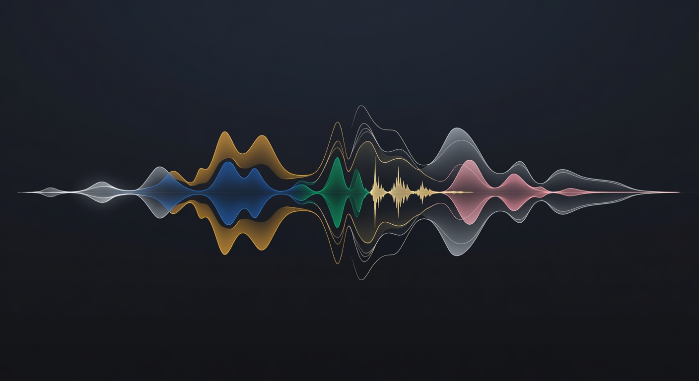
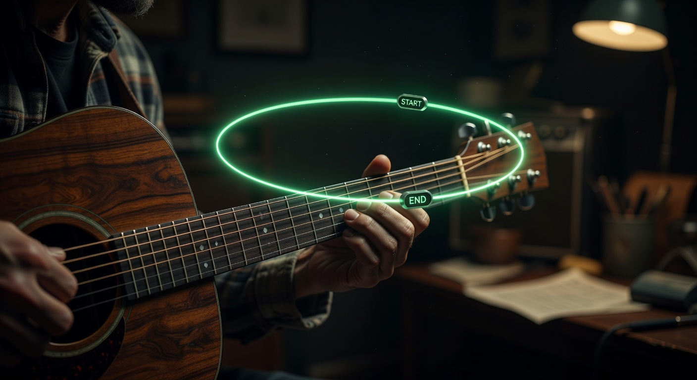

# weblooper

[](https://github.com/schardosin/weblooper/actions/workflows/deploy.yml)

**The beautiful, focused practice tool for musicians.**

Loop any part of a song with pixel-perfect precision. Separate stems with AI that runs entirely in your browser. Save your work and come back anytime — everything stays on your device.


---

## What makes weblooper special

- **Precision looping** — Drag timeline handles or use `[` and `]` keys. Save as many presets as you want.
- **AI stem separation** — Full 6-stem separation (drums, bass, **guitar**, **piano**, vocals, other) runs locally using WebGPU. No uploads. No monthly fees.
- **YouTube + local files** — Paste any YouTube link or load a local audio file. Works the same way.
- **Decoupled stems** — When you separate stems from a YouTube video they become first-class sessions (exactly like local audio). No weird syncing, no video relationship.
- **Recent videos & previous stems** — Jump straight back into anything you were working on. All your loops and stem sessions are saved locally.
- **Beautiful, calm interface** — Designed for long practice sessions. No ads, no accounts, no distractions.



---

## Getting started

```bash
npm install
npm run dev
```

Open http://localhost:5173.

### Quick start (YouTube)

1. Paste a YouTube link and hit **LOAD**
2. Drag the timeline or press `[` and `]` to set your loop
3. Press `L` to turn looping on
4. Use the speed chips or keys `1`–`6` to slow it down
5. (Optional) Click **Separate Stems** — a clean 6-stem model runs locally

### Quick start (local audio + stems)

1. Click **Load local audio file (for stems)**
2. Choose a WAV, MP3, FLAC, etc.
3. Click **Separate Stems** (first run downloads ~84 MB model)
4. Once stems are ready you get the full practice workspace with independent timeline, loop handles, mixer, and speed control



---

## Browser requirements

**For normal looping** — Any modern browser works fine.

**For stem separation** (the powerful part):
- **Strongly recommended**: Chrome or Edge (best WebGPU support)
- Firefox works but is usually slower
- Safari is often unreliable or very slow

**For YouTube stem separation**:
- Requires a Chromium-based browser (Chrome, Edge, Brave, etc.)
- Uses the tab audio capture API (`getDisplayMedia` + `preferCurrentTab`)

The first stem separation will download a large model (~84 MB). After that everything is local.

---

## Keyboard shortcuts

| Key       | Action                              |
|-----------|-------------------------------------|
| `Space`   | Play / Pause                        |
| `[`       | Set loop **start** at current time  |
| `]`       | Set loop **end** at current time    |
| `L`       | Toggle looping                      |
| `R`       | Restart from the beginning of the loop |
| `1`–`6`   | Change playback speed (0.5× → 2×)   |
| `←` / `→` | Nudge playhead by 1 second          |
| `?`       | Show shortcuts modal                |
| `Esc`     | Close modals                        |

You can also drag the green timeline handles for precise visual control.

---

## Tech

- Vite + TypeScript + Tailwind CSS v4
- YouTube IFrame Player API (no backend, no tracking)
- 6-stem separation via **demucs-rs** (Rust + WebGPU/WASM) — fully client-side
- All state lives in `localStorage` + OPFS (Origin Private File System) for stems
- Tab audio capture for YouTube stem separation (no server required)

---

## Live Site & Deployment

The site is automatically built and deployed via GitHub Actions on every push to `main`.

**Live site:** [https://schardosin.github.io/weblooper/](https://schardosin.github.io/weblooper/)

### One-time manual setup (required the first time)

GitHub requires you to enable GitHub Actions as the deployment source **once** in the UI:

1. Go to **Settings → Pages** in this repository.
2. Under **"Build and deployment" → Source**, select **GitHub Actions**.
3. Save.

After this one-time step, the workflow will automatically build and deploy on every push to `main`.

**Live site (after first successful deploy):**  
https://schardosin.github.io/weblooper/

---

## Philosophy

weblooper exists for one reason: help musicians practice the hard parts.

- No accounts
- No tracking
- No bullshit
- Everything runs locally when possible
- The interface should feel calm and precise, even during long sessions

---

## Deploy

Pure static site. Works anywhere:

- Vercel / Netlify / Cloudflare Pages (just point at the repo)
- GitHub Pages (`npm run build` then push `dist`)

---

## License

MIT — do whatever you want with it.

---

Made with focus for people who actually practice the hard parts.